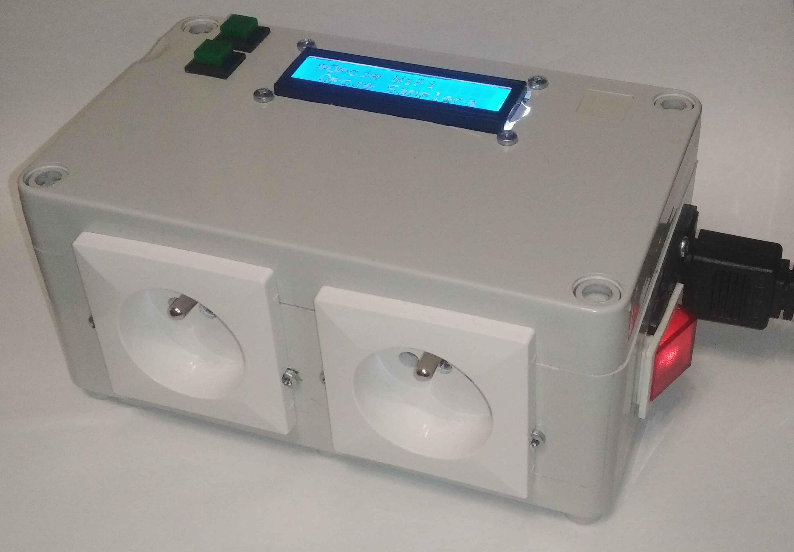
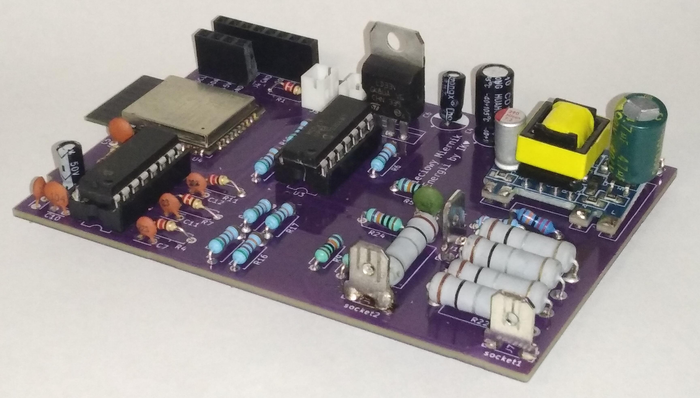
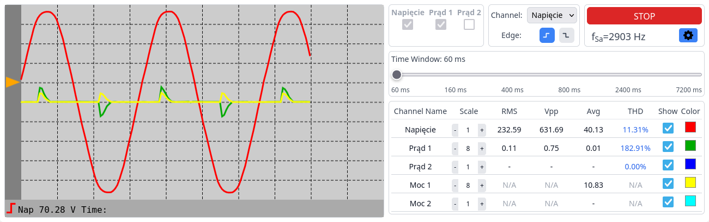

# Power Panel with Built-in Energy Analyzer based on ESP32

## Project Description
This project was realized as part of my engineering thesis at the Warsaw University of Technology. The device measures the voltage and current of connected devices. The measured data is transmitted from the device to a web application, where it is analyzed. In real-time, the application processes the gathered data and presents the electrical parameters and visualizations of the voltage and current waveforms to the user.

The device is controlled via the web application – measurements are read, results are visualized, and analysis is performed there. The operation is intuitive:
1. Connect the device to power.
2. Connect to it via Wi-Fi.
3. Connect the device you want to test.
4. Measurement results and analysis are available in the web interface.

The final result of the project is a ready-to-use IoT device.

## System Architecture
The project consists of three main components:

1. **Meter Controller** (ESP32 + measurement circuit) – responsible for Wi-Fi connectivity, menu handling, and managing the measurement circuit.
2. **Backend (ESP32 HTTP/WebSocket Server)** – allows control of the device via HTTP endpoints and fast transmission of measurement results via WebSocket.
3. **Frontend (Angular)** – the web application responsible for controlling the meter, analyzing the received data, and presenting both calculated values and waveform visualizations.
4. **PCB Design** – connects all physical components of the meter control board.

## Web Interface Functionality
- **View Electrical Parameters and Harmonic Analysis** – real-time display of measurement results for voltage, current, and power, as well as THD coefficient and harmonic analysis.
- **Waveform Visualization** – shows measured waveforms on a virtual oscilloscope.
- **Measurement Channel and System Parameter Configuration** – allows setting different channels and adjusting device parameters.
- **Trigger Selection and Analysis Window Width Adjustment** – stabilizes waveform drawing and adjusts measurement precision.
- **Meter Calibration** – adjusts calibration coefficients and selects network frequency (50/60Hz).

## Repository Structure
- **smm-esp32** – Source code for ESP32 (C, ESP-IDF)
- **smm-frontend** – Web application (Angular, TypeScript)
- **smm-pcb** – PCB design (KiCad)

## Device Photos

### Final Device

### Meter Control Board PCB

### Web Interface in Use

